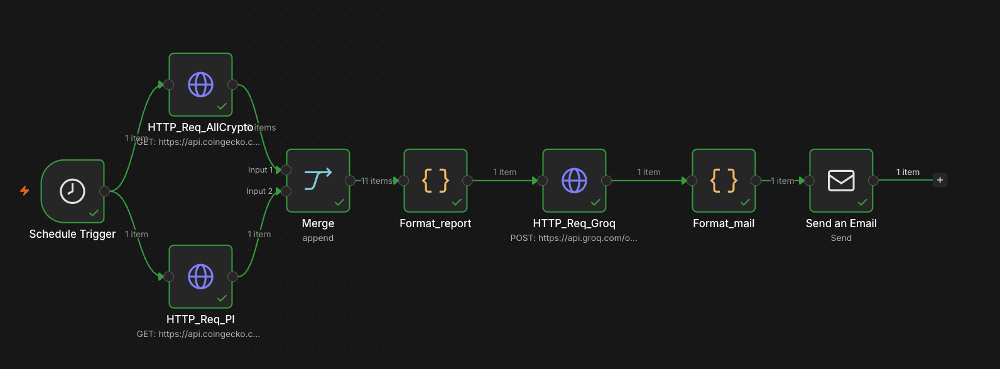

# 🚀 CryptNews — Automated Crypto Daily Report

> An automated workflow built with **n8n** that fetches real-time crypto market data, analyzes it with **Groq AI (Llama 3)**, and sends a daily report to your inbox every morning at 9am.


## 📋 What it does

Every morning at **9:00 AM**, the workflow:

1. **Fetches** the Top 10 cryptocurrencies by market cap from CoinGecko
2. **Fetches** Pi Network price history over the last 48 hours
3. **Merges** both data sources
4. **Formats** the data into a clean market summary
5. **Analyzes** it with Groq AI (Llama 3.3 70B) to generate a French-language report
6. **Sends** the report to your Gmail inbox via SMTP

---

## 🧩 Workflow Architecture



```
Schedule Trigger (9h)
    ├── HTTP_Req_AllCrypto (CoinGecko Top 10)
    ├── HTTP_Req_PI (Pi Network 48h)
    ├── Merge (Append)
    ├── Format_report (Code)
    ├── HTTP_Req_Groq (Llama 3.3 70B)
    ├── Format_mail (Code)
    └── Send Email (Gmail SMTP)
```
---

## 🛠️ Tech Stack

| Tool | Usage |
|---|---|
| **n8n** | Workflow automation |
| **CoinGecko API** | Crypto market data (free, no API key required) |
| **Groq API** | AI analysis with Llama 3.3 70B (free tier) |
| **Gmail SMTP** | Email delivery |

---

## 📦 Prerequisites

- [n8n](https://n8n.io) — self-hosted via Docker or n8n Cloud
- [Groq API key](https://console.groq.com) — free account
- Gmail account with [App Password](https://myaccount.google.com/apppasswords) enabled

---

## 🚀 Getting Started

### 1. Clone the repo

```bash
git clone https://github.com/Vincentfrg/cryptnews-n8n.git
cd cryptnews-n8n
```

### 2. Start n8n with Docker

```bash
docker run -it --rm \
  -p 5678:5678 \
  -v n8n_data:/home/node/.n8n \
  n8nio/n8n
```

Open [http://localhost:5678](http://localhost:5678)

### 3. Import the workflow

In n8n: **Menu (⋯) → Import from file** → select `workflow.json`

### 4. Configure credentials

#### Groq API
- In the `HTTP_Req_Groq` node → Edit credential
- **Name** → `Authorization`
- **Value** → `Bearer YOUR_GROQ_API_KEY`

#### Gmail SMTP
- In the `Send Email` node → Edit credential
- **Host** → `smtp.gmail.com`
- **Port** → `465`
- **User** → `your.email@gmail.com`
- **Password** → Your Gmail App Password (16 characters)

### 5. Update your email

In the `Send Email` node, update:
- **From** → `your.email@gmail.com`
- **To** → `your.email@gmail.com`

### 6. Activate the workflow

Toggle the workflow to **Active** — it will run every day at 9:00 AM.

---

## 📧 Sample Report

```
🚀 Crypto Daily Report - 17/06/2026

**Rapport de marché des cryptomonnaies**

**1. Tendance générale**
La tendance générale du marché des cryptomonnaies au cours des 48 dernières heures 
est négative. Les 10 premières cryptomonnaies ont toutes enregistré des baisses...

**2. Analyse Bitcoin**
Le Bitcoin a perdu 2,37% au cours des 24 dernières heures, ce qui porte son prix 
à 55 858 EUR...

**3. Analyse Pi Network**
Le Pi Network a enregistré une baisse de 2,22% au cours des 48 dernières heures...

**Conclusion**
En résumé, le marché des cryptomonnaies est actuellement dans une phase baissière...
```

---

## 🔧 Customization

### Add more cryptocurrencies
Edit the `HTTP_Req_AllCrypto` URL and increase `per_page`:
```
https://api.coingecko.com/api/v3/coins/markets?vs_currency=eur&order=market_cap_desc&per_page=20
```

### Change the report language
Edit the prompt in `Format_report` node — replace `en français` with your language.

### Change send time
Edit the `Schedule Trigger` node → update the **Hour** field.

---

## 📁 Project Structure

```
cryptnews-n8n/
├── README.md          # This file
├── workflow.json      # n8n workflow export
├── .gitignore         # Ignores .env files
└── assets/
    └── workflow.png   # Workflow screenshot
```

---

## ⚠️ Security

- Never commit your API keys or passwords
- Use `.env` files for sensitive data (already in `.gitignore`)
- The `workflow.json` does not contain any credentials — they are stored locally by n8n

---

## 📄 License

MIT — feel free to use, modify and share.

---

## 👤 Author

**Vincent Ferrag**
- GitHub: [@Vincentfrg](https://github.com/Vincentfrg)
- Portfolio: [vincentfrg.vercel.app](https://vincentfrg.vercel.app)